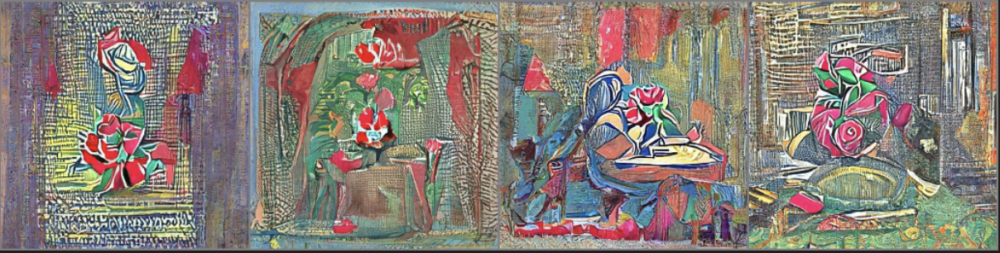
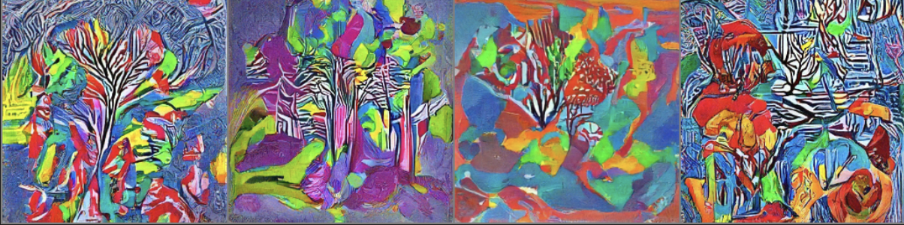
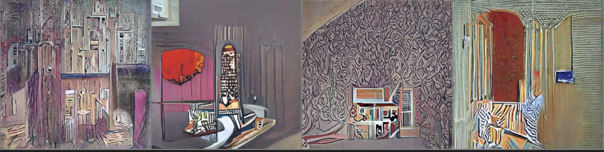
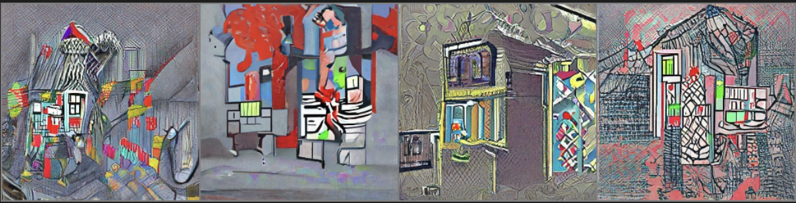

## Multiple
* This is demo project use CLIP as a Multi-Module modle to control the output of Diffusion model
## CLIP model generated results
| Prompt                                                                                                       | Generated Images |
|--------------------------------------------------------------------------------------------------------------|------------------|
| Red Rose (still life), red flower painting                                                                  |           |
| Psychedelic: autumn forest landscape, psychedelic style, vibrant colors, swirling patterns, abstract forms, surreal, trippy, colorful |          |
| Interior: a living room, bright modern Scandinavian style house, large windows, magazine photoshoot, 8k, studio lighting |       |
| Pixel: haunted house, pixel-art, low-res, blocky, pixel art style, 8-bit graphics, colorful                |          |

