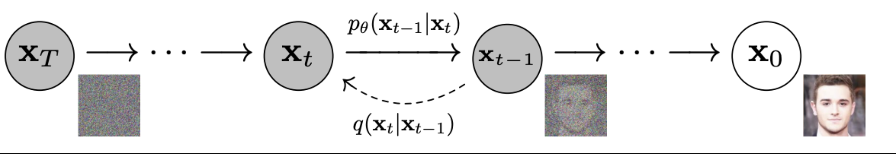

## Multiple
* This is demo project use CLIP as a Multi-Module modle to control the output of Diffusion model
## Background of the model
* This model is a diffusion model initialized from [Google DDPM-bedroom-256](https://huggingface.co/google/ddpm-bedroom-256) and trained for 5000 steps on dataset [huggan/wikiart](https://huggingface.co/datasets/huggan/wikiart). [Script to train model (colab ipynb)](https://colab.research.google.com/drive/1EnvN5OQMRzZZDAZJWDCVq4ETau9-JnCu?usp=sharing)

* wikiart Dataset containing 81,444 pieces of visual art from various artists, taken from WikiArt.org, along with class labels for each image. It contains 27 types of styles.

* while the ddpm scheduler yields the highest quality, it also takes the longest. For a good trade-off between quality and inference speed you might want to consider the ddim or pndm schedulers instead.
* [DDPM paper](https://arxiv.org/pdf/2006.11239.pdf)
* 
* Forward Process: This process starts with one data point and gradually adds noise until the data is completely transformed into noise. It is a Markov chain that adds a certain amount of Gaussian noise at each step, the process is deterministic and can be reversed.

* Reverse Diffusion (Reverse Process): the reverse process is a reversal of the diffusion process, which starts with pure noise and gradually removes the noise to recover the data. This process is a parameterized Markov chain that needs to be trained to learn how to reverse the diffusion process.

* Training: The inverse process is trained by optimizing a variational bound. This lower bound is calculated by comparing the difference between the inverse process and the real data distribution. The goal of training is to enable the inverse process to generate samples that match the real data distribution.

* Sampling: To generate samples, a noise vector is sampled from the standard normal distribution as a starting point, and then the data is generated step by step through the inverse process. At each step, the model predicts how the current noise vector should change to more closely match the true data distribution.

* Progressive Generation: The diffusion model's generation process is progressive, meaning that it generates a rough outline of the image first and then adds details gradually. This property makes the images generated by the diffusion model have high fidelity.

* Connection to Autoregressive Models: A diffusion model can be viewed as an autoregressive model in which each part of the data is generated not in a regular order, but in a specific order determined by the diffusion process.

* Potential Applications: Diffusion models have the potential to be used in a variety of fields such as data compression, art creation, image editing, etc. due to their ability to generate high quality samples.

## CLIP model generated results
| Prompt                                                                                                       | Generated Images |
|--------------------------------------------------------------------------------------------------------------|------------------|
| Red Rose (still life), red flower painting                                                                  |           |
| Psychedelic: autumn forest landscape, psychedelic style, vibrant colors, swirling patterns, abstract forms, surreal, trippy, colorful |          |
| Interior: a living room, bright modern Scandinavian style house, large windows, magazine photoshoot, 8k, studio lighting |       |
| Pixel: haunted house, pixel-art, low-res, blocky, pixel art style, 8-bit graphics, colorful                |          |

